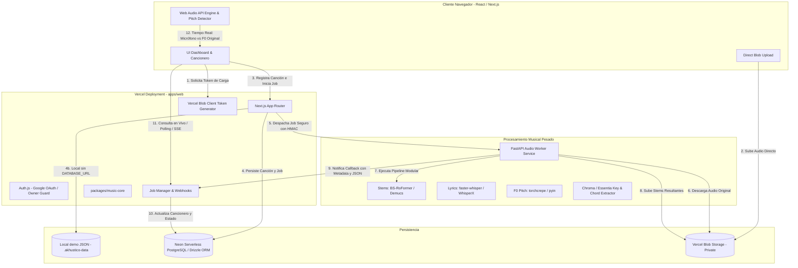

# Arquitectura del Sistema — AKHUSTICO Studio

## 1. Principios de Diseño
1. **Desacoplamiento Estricto:** La UI web y la persistencia no deben conocer la implementación interna de los modelos de IA de audio.
2. **Compatibilidad Serverless:** Todo el frontend y API ligera residen en Next.js optimizado para Vercel (Edge/Node Serverless), sin depender del sistema de archivos local para persistencia en producción ni almacenar binarios pesados en la base de datos. En desarrollo sin `DATABASE_URL`, el fallback demo usa `.akhustico-data/akhustico.local.json` para no perder canciones entre reinicios locales.
3. **Cero Payload Pesado en Vercel Functions:** La subida de audio se realiza directamente desde el navegador hacia **Vercel Blob** mediante URLs prefirmadas / client tokens.
4. **Procesamiento Asíncrono por Jobs:** Las tareas intensivas de ML (separación de pistas, transcripción fonética, F0, acordes) se delegan al **Audio Worker** (Python/FastAPI) o proveedores externos vía el patrón Provider.
5. **Determinismo Musical:** La transposición, el cálculo de acordes con cejilla (capo), el cálculo de cents y el scoring vocal se resuelven mediante lógica matemática pura en `packages/music-core`, nunca delegados a LLMs.

---

## 2. Diagrama de Arquitectura



---

## 3. Capas del Monorepo

```text
akhustico/
├── apps/
│   └── web/                     # Next.js 15+ App Router, Tailwind CSS, Web Audio, Auth.js
├── services/
│   └── audio-worker/            # Python 3.11+, FastAPI, PyTorch, audio-separator, librosa
├── packages/
│   ├── shared/                  # Tipos TypeScript compartidos, schemas Zod, contratos de API
│   ├── music-core/              # Algoritmos de transposición, F0 <-> MIDI, cents, acordes, capo
│   └── ui/                      # Sistema de componentes de diseño (tema dark estudio)
├── docs/                        # Documentación técnica completa
├── .agents/                     # Definición de subagentes Antigravity
├── .env.example
├── package.json
└── pnpm-workspace.yaml
```

---

## 4. Patrón Provider de Procesamiento de Audio

Para asegurar que la aplicación web no quede atada a una única infraestructura de IA, se define la siguiente interfaz en TypeScript:

```typescript
export interface AudioProcessingProvider {
  name: string;
  submitJob(payload: ProcessingJobPayload): Promise<ProcessingJobResult>;
  getJobStatus(jobId: string): Promise<JobStatusResponse>;
  cancelJob(jobId: string): Promise<boolean>;
}
```

Implementaciones soportadas:
1. `MockAudioProcessingProvider`: Utilizado en desarrollo local, testing y cuando no hay GPU configurada. Genera stems sintéticos, acordes y melodías demo para una experiencia 100% funcional.
2. `ExternalAudioWorkerProvider`: Conecta mediante HTTP + HMAC con el microservicio Python `services/audio-worker`.
3. `ReplicateProcessingProvider`: (Preparado para futuro) Permite ejecutar modelos en la nube serverless de Replicate si el usuario no desea levantar el worker propio.

---

## 5. Seguridad y Autenticación
- **Restricción de Propietario (`OWNER_EMAIL`):** La aplicación rechaza cualquier inicio de sesión cuyo correo no coincida exactamente con `OWNER_EMAIL`.
- **Bypass de Desarrollo (`DEV_AUTH_BYPASS`):** Habilita una sesión simulada en localhost para trabajar rápidamente sin requerir tokens de Google OAuth en local. Totalmente bloqueado en producción (`NODE_ENV === 'production'`).
- **Seguridad en Comunicación Worker:** Las llamadas entrantes del worker hacia `/api/jobs/callback` requieren la validación del encabezado `x-akhustico-signature` derivado de `WORKER_SECRET`.
