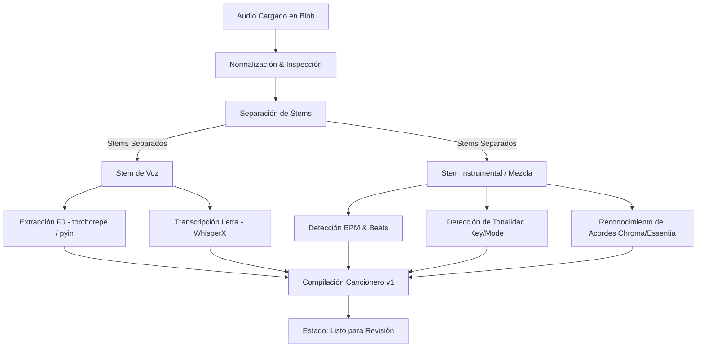

# Pipeline de Procesamiento de Audio — AKHUSTICO Studio

El procesamiento musical en AKHUSTICO Studio está diseñado de forma **asíncrona**, **modular** y **tolerante a fallos**. Si una etapa analítica falla (por ejemplo, transcripción de letra en pistas instrumentales), el sistema no aborta los resultados válidos (como BPM o separación de stems).

---

## 1. Fases del Pipeline

---

## 2. Descripción de Componentes

### 1. Normalización de Audio
- Inspección de formato, duración, sample rate y canales.
- Conversión interna a WAV 44.1kHz / 16-bit para procesamiento óptimo de redes neuronales.
- Generación de forma de onda (waveform peaks) en JSON para renderizado instantáneo en el navegador.

### 2. Separación de Stems (`audio-separator`)
- **Modelos preferidos:**
  - *BS-RoFormer* (ViperX) para separación de máxima fidelidad (Voz / Instrumental o 4/6 Stems).
  - *Demucs v4* (HTDemucs) como fallback confiable.
- **Perfiles:**
  - `FAST`: 2 stems (Vocals + Instrumental) para análisis rápido.
  - `BALANCED`: 4 stems (Vocals, Drums, Bass, Other).
  - `HIGH QUALITY`: 6 stems (Vocals, Drums, Bass, Guitar, Piano, Other).
- Cada pista generada se comprime a MP3 320kbps / FLAC y se almacena en Vercel Blob vinculada a `song_assets`.

### 3. Transcripción de Letra Sincronizada
- Implementado con **WhisperX** / **faster-whisper**.
- Produce marcas temporales a nivel de palabra (`word-level timestamps`).
- Algoritmo de alineación fonética para asociar palabras a compases y acordes.

### 4. Melodía Vocal F0
- Análisis prioritario sobre el stem de voz (`vocals`).
- Detección precisa de tono mediante `torchcrepe` o `librosa.pyin`.
- Conversión de frecuencia fundamental en Hertz a nota MIDI continua:
  $$\text{MIDI} = 69 + 12 \times \log_2\left(\frac{f}{440}\right)$$
- Filtro de mediana y umbral de sonoridad (`voiced flag`) para descartar ruidos de respiración y silencios.
- Downsampling a 20ms por frame para el canvas de práctica.

### 5. Detección de BPM, Tonalidad y Acordes
- **BPM & Beats:** Extracción de onset envelope y beat tracker con subdivisión de compás.
- **Tonalidad:** Algoritmo Krumhansl-Schmuckler sobre perfiles de cromagramas (HPCP) ponderando tónicas mayores y menores.
- **Acordes:** Análisis de ventanas armónicas sobre el instrumental, reconociendo tríadas, séptimas, suspensiones y slash chords con métrica de confianza.

---

## 3. Manejo de Errores y Tolerancia
- Cada fase se ejecuta en bloques independientes con `try/except`.
- Si el modelo de acordes produce baja confianza en una sección, se marca como `uncertain` para que el usuario la revise manualmente en el editor.
- Los logs legibles se almacenan en `processing_jobs.outputPayload.logs` para trazabilidad inmediata.
